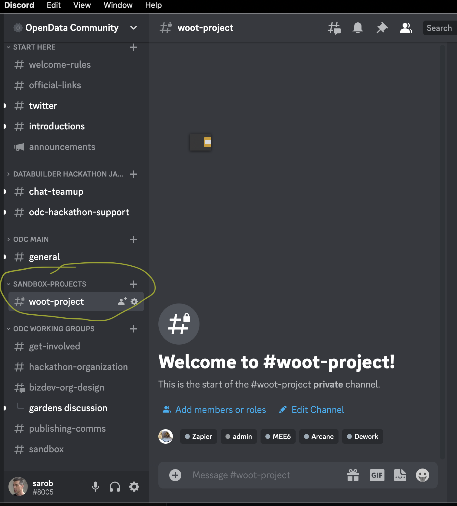
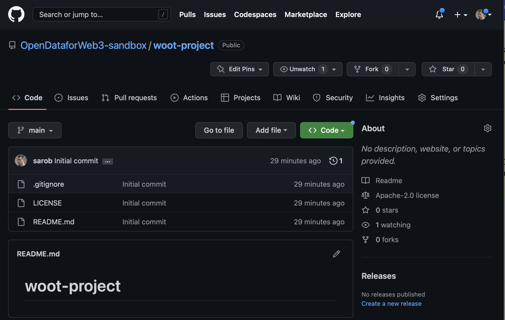

# Sandbox
This repository collects efforts by the OpenData Community to support and even lead open source projects that support our mission.

We are in the process of defining our v 1.0 of this support.  You can join that discussion and help out by joining the #sandbox channel on our Discord.

## Likely areas of support may include:
- A home for useful projects
   - if needed, sub repositories here or elsewhere
   - dedicated Discord channel
   - web site listings
- Ongoing promotion 
   - Twitter spaces 
- Technical reviews
   - This due dilligence can be useful 
   - Due dilligence will also be used to determine which projects to highlight
- Featured inclusion in the Landscape
- Featured inclusion in our data stack
- Hackathon focus
   - Sandbox projects that have been reviewed may be featured in hackathons
- Ongoing hackathon - aka bounties

## Future directions may include:
- Grants program
- Aqueduct
- Governance or metagovernance assistance
- Smart contract audits
- Other launch assistance

We are extremely proud of all alumnni hackathon contestants.  Many alumnni are collaborating on the Sandbox and other projects now.

## Regarding Sandbox requirements, projects should:
- have a stated open source license
    - at this time we think either GPT3 or Apache2 are preferable
- be able to concisely communicate their value and status
    - why does the project exist
    - what are the immediate development and other priorities
    - how can the ODC help?

## How to become a ODC Sandbox project
- Long term we want the sandbox to be self serve for any ODC member to be able to create a project with a mimimum of overhead to get started
- Short term we need to limit the number of projects as we get started. We will figure out how to support more projects with less staff and volunteers. 
- **A Link will be provided here shortly for signup. We will also be reaching out directly to a few teams and projects.** 

## Our best estimate of what we will provide to a ODC Sandbox project
- We provide ODC mentoring to help new members on how to operate a project. The ODC Jedi are the mentors to start.
- We provide the ODC Sandbox github organization https://github.com/OpenDataforWeb3-sandbox 
- The https://github.com/OpenDataforWeb3/sandbox is location of all the how to create and maintain an ODC sandbox project documentation and the index to all the sandbox projects
- We provide easy instructions on how to create a repository within the ODC Sandbox github organization for their work and team. Two good options:
  - Make the project leader a member of the github organization and have them follow https://docs.github.com/en/get-started/quickstart/create-a-repo OR
  - Ask the project leader to push a PR "Create a Sandbox Repository for my XYZ Project" to the OpenDataforWeb3/Sandbox repository and we automate the creation of the repository.
- We provide access to tools:
  - Comms: Discord
  - Project: Github Projects (we setup a project and a training session on using with issues)
  - Wiki: Github wiki (we setup a basic pages)
  - Repository: Github
  - IDE: Visual Studio Code, Github online, and HackMD (we help the project get setup and a training session on pushing PRs)
  - CICD: Github Actions (TBD what we can support)
  - OpenData stack: Operating stack to be used by the ODC members in the analysis and support of sandbox projects. Likely from the [landscape](../../docs/landscape.md) options. Partners and / or sponsors may contribute licensing and pricing options. (TBD what we can support) 
  - **A good place to futher develop strategy on this will be at ETHDenver. Let's revisit design after.**
  - [Find additional Sandbox design in development here](https://miro.com/app/board/uXjVPlv-XQA=/)
  

Please join us!

