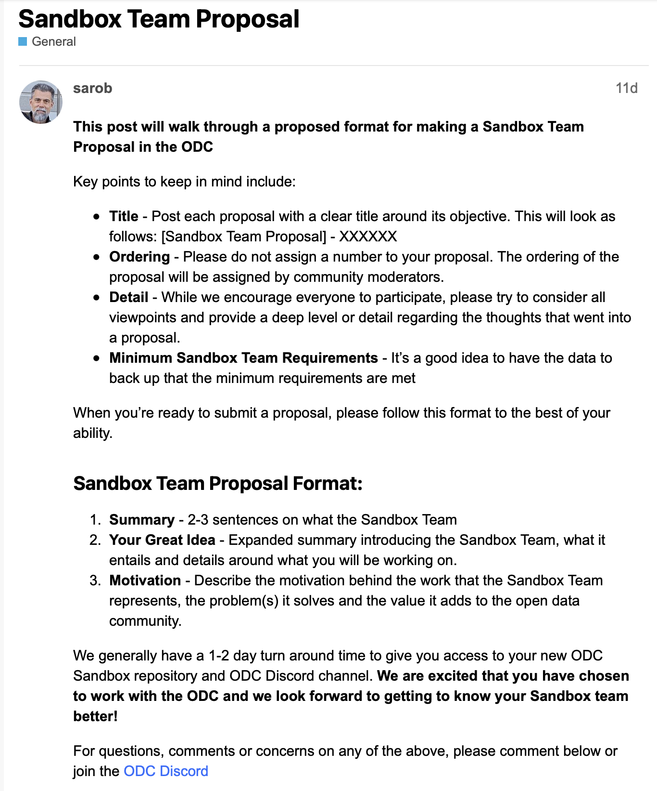

# Sandbox

This repository highlights projects that are supported by the OpenData community; these are all open source and support our mission. 

The Sandbox pipeline have been designed by the community and can be found [here on our forum](https://forum.opendatacommunity.org/t/project-pipeline-in-detail/28/5).

To create your project please start through the sandbox teams [repo](https://github.com/orgs/OpenDataforWeb3-sandbox/repositories) and follow the pipeline, as your project matures and fulfills the process requirements it will be displayed here.  

## Current Sandbox Projects

1. [Grant Review Dashboard](https://github.com/OpenDataforWeb3-sandbox/Grant-Review-Dashboard)
1. [Lego Curration](https://github.com/OpenDataforWeb3-sandbox/Lego-Curration)
1. [Sybil Dashboard](https://github.com/OpenDataforWeb3-sandbox/Sybil-Dashboard)

## What is a Sandbox Project 

A Sandbox project is similar to a Sandbox project as defined by the Cloud Native Computing Foundation.  Sandbox projects have been initially reviewed and supported by OpenData Community members for their value and alignment with the mission of the OpenData Community.  

## What are the Requirements to becoming a Sandbox Project

1. Be an ODC member in good standing
1. Have a great idea for a project that is aligned with the ODC mission and values
1. Indication of intent and capabilities
1. ODC Jedi reviews Sandbox project for minimum requirements

## What are the benefits to being a Sandbox Project

1. No cost inclusion in hackathons - such as bounties that include best contributions to Sandbox projects
1. No cost invites as a speaker in our series of Twitter spaces
1. Ongoing business development and awareness assistance via public and private conversations
1. Optional use of the ODC Sandbox repository to hold your code and documentation
1. Premium real estate in the ODC Discord channel for communications
1. Mentoring on agile software development practices, Github CICD, Github project management tools, and how to use Git with Github repositories. If the Sandbox team opts to use other project management tooling, the mentoring options are best effort depending on the community experience and availability.
1. Ability to build on top of the ODC community of open data

## Formalizing Sandbox project inclusion

Any ODC member  can request to be a Sandbox Project through a form available on our Discourse forum. Simply copy the form and follow the instructions. The [Sandbox Team Proposal instructions can be found here](https://forum.opendatacommunity.org/t/sandbox-team-proposal/30).

## Future Sandbox Teams support may include:
- Grants program
- Aqueduct
- Governance or metagovernance assistance
- Smart contract audits
- Other launch assistance

We are extremely proud of all alumnni hackathon contestants.  Many alumnni are collaborating on the Sandbox and other projects now. [Review our past and future Hackathons here](https://opendatacommunity.org)

- Please join us! [Find additional Sandbox discussion and assistance here:](https://discord.com/channels/1037443230993743902/1075078081439604746)
